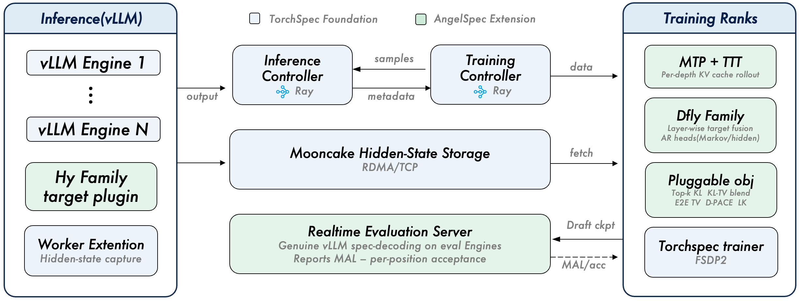
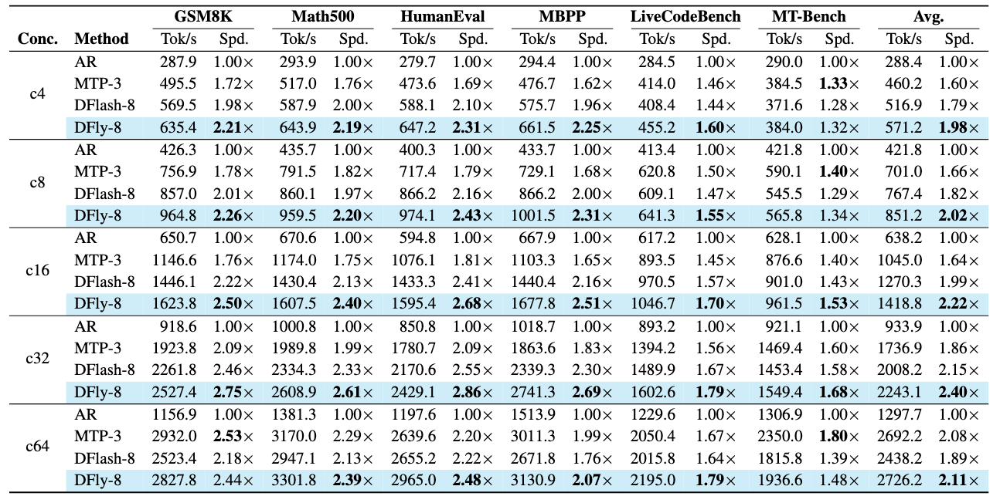
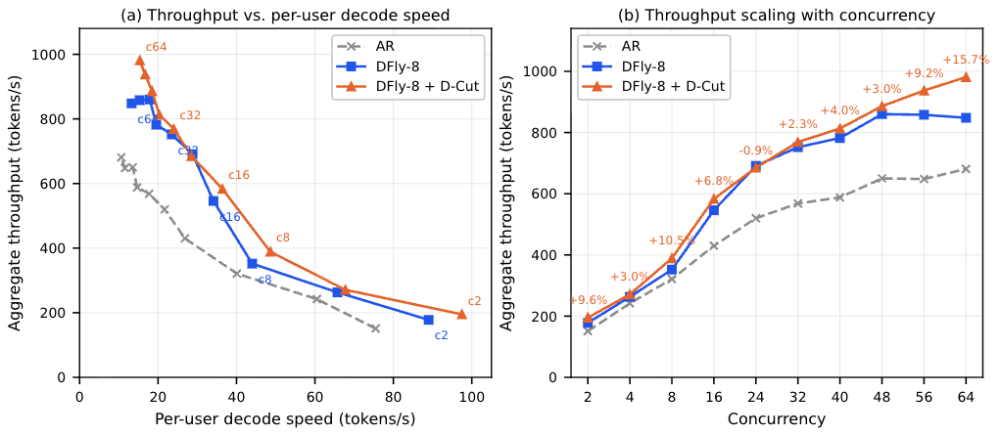

<div align="center">

<picture>
  <source media="(prefers-color-scheme: dark)" srcset="docs/_static/logo_banner_white.png">
  <source media="(prefers-color-scheme: light)" srcset="docs/_static/logo_banner.png">
  
</picture>

**A unified training framework for MTP and block-parallel speculative decoding**

[](https://arxiv.org/abs/2607.25852)
[](https://angelspec.readthedocs.io)
[](https://huggingface.co/collections/AngelSlim/angelspec)
[](LICENSE)

</div>

AngelSpec is developed by the Tencent Hunyuan AI Infra team, which is a torch-native framework for training speculative-decoding draft models, covering both autoregressive MTP drafting and the block-parallel DFlash family. It is the training framework behind the [technical report](https://arxiv.org/abs/2607.25852): all drafters in the report — the TTT-trained MTP drafter and the DFly family — are trained and released with it.

## Latest News

- **[2026/07/29]** We release AngelSpec v0.1.0, supporting MTP and block-parallel speculative decoding training. Check out our [technical report](https://arxiv.org/abs/2607.25852) and [released models](https://huggingface.co/collections/AngelSlim/angelspec).

## Key Features

- **6 draft architectures** — DFly, DFlash, DFlare, Eagle3, DSpark, MTP — behind one training pipeline; switching is a config change
- **MTP training with TTT** — on-policy multi-depth rollout with memory close to a single causal pass; long-context training up to 128k via Ulysses sequence parallelism
- **Acceptance-aligned objectives** — CE, top-k KL, LK losses, D-PACE weighting, and end-to-end TV, composable through configuration
- **Document-aware sequence packing** — Megatron-style fixed-length packing with strict cross-document isolation, on both the DFlash and MTP paths
- **Online evaluation** — genuine speculative decoding against the latest checkpoint during training, reporting mean accepted length and per-position acceptance as measured by the serving engine

## Architecture

<p align="center">
  
</p>

Inference and training run as separate GPU worker groups connected by a [Mooncake](https://github.com/kvcache-ai/Mooncake) tensor store, so hidden-state generation and optimization scale independently. This disaggregated foundation comes from [TorchSpec](https://github.com/lightseekorg/TorchSpec); AngelSpec extends it with the architectures, objectives, and training features above.

## Draft Architectures

| Architecture | Method | Key Idea |
|-------------|--------|----------|
| **DFly** | Block-parallel | Hybrid target conditioning + hidden-correction AR head |
| **DFlash** | Block-parallel | Anchor sampling + parallel block generation |
| **DFlare** | Block-parallel | DFlash + learnable per-layer target fusion |
| **Eagle3** | Autoregressive TTT | Test-time training with input fusion |
| **DSpark** | Hybrid | DFlash backbone + EAGLE-style autoregressive head |
| **MTP** | Single-head TTT | Full MoE decoder layer as draft (Hy3-native) |

See the [draft-model family](https://angelspec.readthedocs.io/en/latest/concepts/draft_model_family.html) docs for details and trade-offs.

## Quick Start

```bash
# Install AngelSpec + the vLLM backend
pip install -e ".[vllm]"
pip install mooncake-transfer-engine

# Single-node quickstart (8 GPUs: 4 inference + 4 training)
./examples/qwen3-8b-dfly/run.sh

# Override config values from CLI
./examples/qwen3-8b-dfly/run.sh training.learning_rate=5e-5 training.num_train_steps=500
```

Or set up a conda environment (installs mooncake too):

```bash
./tools/build_conda.sh 1 vllm     # or: sglang
micromamba activate angelspec
```

> **CUDA 12.x hosts:** PyPI's default `torch` / `vllm` wheels target CUDA 13 and won't load on a CUDA-12 driver. Install CUDA-matched wheels first — see [Installation](https://angelspec.readthedocs.io/en/latest/get_started/installation.html).

## Examples

<details open>
<summary><b>Multi-node (Hy3 target)</b></summary>

| Example | Architecture | Mode | Released Model |
|---------|-------------|------|----------------|
| [hy3-dfly](examples/hy3-dfly/) | DFly | From scratch | [AngelSlim/Hy3-DFly-Block8](https://huggingface.co/AngelSlim/Hy3-DFly-Block8) |
| [hy3-mtp](examples/hy3-mtp/) | MTP | From scratch | [AngelSlim/Hy3-MTP-TTT3](https://huggingface.co/AngelSlim/Hy3-MTP-TTT3) |

</details>

<details>
<summary><b>Single-node (Qwen3-8B target)</b></summary>

| Example | Architecture | Mode | Released Model |
|---------|-------------|------|----------------|
| [qwen3-8b-dspark](examples/qwen3-8b-dspark/) | DSpark | From scratch | — |
| [qwen3-8b-dfly](examples/qwen3-8b-dfly/) | DFly | From scratch | [AngelSlim/Qwen3-8B-DFly-Block8](https://huggingface.co/AngelSlim/Qwen3-8B-DFly-Block8) |
| [qwen3-8b-mtp](examples/qwen3-8b-mtp/) | MTP | From scratch | [AngelSlim/Qwen3-8B-MTP-TTT3](https://huggingface.co/AngelSlim/Qwen3-8B-MTP-TTT3) |
| [qwen3-8b-dfly-cpt](examples/qwen3-8b-dfly-cpt/) | DFly | CPT (from ckpt) | Continue from AngelSlim/Qwen3-8B-DFly-Block8 |

</details>

<details>
<summary><b>Available training configs</b></summary>

| Config | Architecture | Features |
|--------|-------------|----------|
| `configs/vllm_qwen3_8b_dfly.yaml` | DFly | Block-parallel + hidden correction |
| `configs/vllm_qwen3_8b_dflare.yaml` | DFlare | Per-layer target fusion |
| `configs/sglang_qwen3_8b_dflash.yaml` | DFlash | SGLang backend |
| `configs/sglang_qwen3_8b_dspark.yaml` | DSpark | Markov head + confidence |
| `configs/vllm_qwen3_8b_mtp_pack_usp_40k.yaml` | MTP | Packing + USP 40k seq |

</details>

## Released Models

Draft models trained with AngelSpec:

| Model | Architecture | Target | Mode |
|-------|-------------|--------|------|
| [AngelSlim/Hy3-DFly-Block8](https://huggingface.co/AngelSlim/Hy3-DFly-Block8) | DFly | Hy3 | No-think |
| [AngelSlim/Hy3-DFly-Block8-Think-High](https://huggingface.co/AngelSlim/Hy3-DFly-Block8-Think-High) | DFly | Hy3 | High-think |
| [AngelSlim/Hy3-MTP-TTT3](https://huggingface.co/AngelSlim/Hy3-MTP-TTT3) | MTP | Hy3 | No-think |
| [AngelSlim/Qwen3-8B-DFly-Block8](https://huggingface.co/AngelSlim/Qwen3-8B-DFly-Block8) | DFly | Qwen3-8B | No-think |
| [AngelSlim/Qwen3-8B-MTP-TTT3](https://huggingface.co/AngelSlim/Qwen3-8B-MTP-TTT3) | MTP | Qwen3-8B | No-think |

## Benchmark

### Offline Throughput (HY3-295B-A21B, TP=8)

<p align="center">
  
</p>

Output-token throughput (Tok/s) and speedup relative to AR at temperature 1 across concurrency levels. Each cell uses 3 × 120 s windows; Avg. is the arithmetic mean across six datasets.

### Live Traffic Throughput (D-cut)

<p align="center">
  
</p>

D-cut on Hy3 live traffic (Hy3-295B-A21B, TP=8, 8× H20; concurrency 2–64). **(a)** Aggregate throughput vs. per-user decode speed — points up and to the right are better. **(b)** Aggregate throughput vs. concurrency — DFly saturates beyond concurrency 48, whereas D-cut continues to convert additional load into throughput.

## License

This project is released under [LICENSE](LICENSE). AngelSpec is built upon [TorchSpec](https://github.com/lightseekorg/TorchSpec) by LightSeek Foundation and uses [Mooncake](https://github.com/kvcache-ai/Mooncake) for disaggregated hidden-state transfer.

## Citation

If you find AngelSpec useful, please cite:

```bibtex
@article{angelspec2026,
  title   = {AngelSpec: Towards Real-World High Performance Inference with Speculative Decoding},
  author  = {Liu, Hong and Cen, Rui and Shi, Junhan and Qin, Guangshuo and Zhang, Jiebin and Liu, Tianyu and Fan, Runzhi and Zhao, Guoliang and Xie, Ruobing and Zhang, Kai and Liu, Song and Yu, Guanghua and Zhu, Jianchen},
  journal = {arXiv preprint arXiv:2607.25852},
  year    = {2026}
}
```

## Projects in teams

- [AngelSlim](https://github.com/Tencent/AngelSlim): A more accessible, comprehensive, and efficient toolkit for large model compression.
